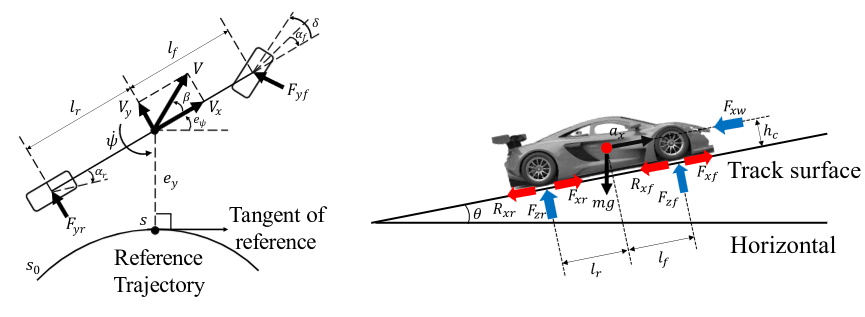
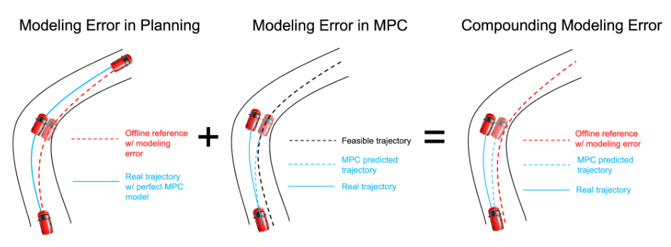
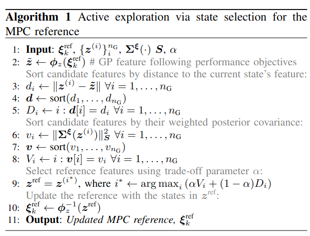

## Data-Driven Methods for Control \& Planning

### Trajectory Planning with Dynamic Movement Primitives <a href="https://sites.google.com/berkeley.edu/racingdmp/home">(Project Website)</a>

Real-time Trajectory Generation via Imitation Learning of Dynamic Movement Primitives

<blockquote>
We employ sequences of motion primitives for real-time trajectory planning in racecar control with Dynamic Movement Primitives (DMPs).  We introduce the Acceleration goal (Acc. goal) DMP, extending the DMP's target system to accommodate accelerating targets. When sequencing DMPs to model long trajectories, our (Acc. goal DMP explicitly models acceleration at the junctions where one DMP meets its successor in the sequence. Applicable to DMP weights learned by any method, the proposed DMP generates trajectories with less aggressive acceleration and jerk during transitions between DMPs compared to second-order DMPs. Our proposed DMP sequencing method can recover from trajectory deviations, achieve competitive lap times, and maintain stable control in autonomous vehicle racing within the high-fidelity racing game Gran Turismo Sport.
</blockquote>

 
 

 
<iframe width="560" height="315" src="https://www.youtube.com/embed/8_GEzYPwz4s?modestbranding=1&autohide=1&showinfo=0&controls=1&rel=0" frameborder="0" allowfullscreen></iframe>

 

#### Highlight of my Contributions:

- Derivation of the Accel. Goal DMP and target sequencing method for third order DMPs
- Implementation of the DMP code, including imitation learning from a demonstrated trajectory and online trajectory generation
- Adaptaion of MPC to include a cost function suitable for the DMP framework and improvements to the MPC formulation and implementation
- Experiment design, implementation, and analysis 
- Creation of manuscript, submission, and revision as corresponding author
 
 

#### Visit the 🔗 <a href="https://sites.google.com/berkeley.edu/racingdmp/home">Project Website</a> for the manuscript, videos, and more information about this project.

 

### Data-Driven Model Predictive Control for Autonmous Racing

Outracing Human Racers: Model-based Trajectory Planning and Control

Available at: [arxiv.org/abs/2211.09378](https://arxiv.org/abs/2211.09378)
<blockquote>
In this work, we investigate how to approach human expert-level racing performance with model-based planning and control methods using the high-fidelity racing simulator Gran Turismo Sport (GTS). We focus on the commonly adopted model-based racing framework, consisting of an offline trajectory planner and an online Model Predictive Control-based (MPC) tracking controller. We thoroughly investigate the design challenges from three perspective, namely vehicle model, planning algorithm, and controller design, and propose novel solutions to improve the baseline approach toward human expert-level performance. We showed that the proposed control framework can achieve top 0.95% lap time among human-expert players in GTS. Furthermore, we conducted comprehensive ablation studies to validate the necessity of proposed modules, and pointed out potential future directions to reach human-best performance. 
</blockquote>

 

#### Highlight of my Contributions:

- Significant contribution to initial model, formulation, code, and preliminary experiments
- Extensive manuscript editing and revising
- Ongoing management of code and control system for autonomous racing
 

 

Double-Iterative Gaussian Process Regression for Modeling Error Compensation 

Available at: [arxiv.org/abs/2305.07740](https://arxiv.org/abs/2305.07740)
<blockquote>
 While offline planning allows optimizing a full reference trajectory for the minimum lap time objective, such modeling discrepancies are particularly detrimental when using offline planning, as planning model errors compound with controller modeling errors. Gaussian Process Regression (GPR) can compensate for modeling errors. However, previous works primarily focus on modeling error in real-time control without consideration for how the model used in offline planning can affect the overall performance. In this work, we propose a double-GPR error compensation algorithm to reduce model uncertainties; specifically, we compensate both the planner's model and controller's model with two respective GPR-based error compensation functions. Furthermore, we design an iterative framework to re-collect error-rich data using the racing control system.
</blockquote>

 

  

#### Highlight of my Contributions:

- Advising on problem formulation and Gaussian Process regression 
- Extensive manuscript editing and revising
- Code environment setup, review, and ongoing management of code and control system for autonomous racing
 
 

Active Exploration in Iterative Gaussian Process Regression for Uncertainty Compensation

<blockquote>
In autonomous racing, both dynamics model error and opponent behavior can be modeled with Gaussian Process (GP) regression. GP models can be updated iteratively from data collected using the controller, but the strength of the GP model depends on the diversity of the training data. We propose a **novel active exploration mechanism for iterative GP regression** that purposefully collects additional data at regions of higher uncertainty in the GP model.
</blockquote>

 

  

#### Highlight of my Contributions:

- Advising on problem formulation and Gaussian Process modeling in the multi-player scenario 
- Extensive manuscript editing and revising
- Code environment setup, review, and ongoing management of code and control system for autonomous racing
 
 
