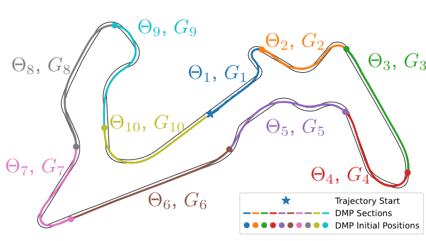

## Data-Driven Methods for Control

### Dynamic Movement Primitives <a href="https://sites.google.com/berkeley.edu/racingdmp/home">(Project Website)</a>

Real-time Trajectory Generation via Imitation Learning of Dynamic Movement Primitives for Autonomous Racing

<blockquote>
We employ sequences of motion primitives for real-time trajectory planning in racecar control with Dynamic Movement Primitives (DMPs).  We introduce the Acceleration goal (Acc. goal) DMP, extending the DMP's target system to accommodate accelerating targets. When sequencing DMPs to model long trajectories, our (Acc. goal DMP explicitly models acceleration at the junctions where one DMP meets its successor in the sequence. Applicable to DMP weights learned by any method, the proposed DMP generates trajectories with less aggressive acceleration and jerk during transitions between DMPs compared to second-order DMPs. Our proposed DMP sequencing method can recover from trajectory deviations, achieve competitive lap times, and maintain stable control in autonomous vehicle racing within the high-fidelity racing game Gran Turismo Sport.
</blockquote>

 
 

 
<iframe width="560" height="315" src="https://www.youtube.com/embed/8_GEzYPwz4s?modestbranding=1&autohide=1&showinfo=0&controls=1&rel=0" frameborder="0" allowfullscreen></iframe>

 

#### Highlight of my Contributions:

- Derivation of the Accel. Goal DMP and target sequencing method for third order DMPs
- Implementation of the DMP code, including imitation learning from a demonstrated trajectory and online trajectory generation
- Adaptaion of MPC to include a cost function suitable for the DMP framework and improvements to the MPC formulation and implementation
- Experiment design, implementation, and analysis 
- Creation of manuscript, submission, and revision as corresponding author
 
 

#### Visit the 🔗 <a href="https://sites.google.com/berkeley.edu/racingdmp/home">Project Website</a> for the manuscript, videos, and more information about this project.

