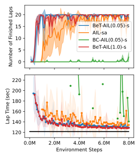

## End-to-end Learning Projects

### Sparse Reward Reinforcement Learning  <a href="https://sites.google.com/view/skill-critic">(Project Website)</a>

<b>Skill-Critic</b>: Refining Learned Skills for Hierarchical Reinforcement Learning

<blockquote>
Our Skill-Critic algorithm optimizes both the low and high-level policies of a hierarchial agent, AND these policies are  initialized and regularized by a latent space learned from offline demonstrations to guide the joint policy optimization. We validate our approach in multiple sparse RL environments, including a new sparse reward autonomous racing task in Gran Turismo Sport. The experiments show that Skill-Critic's low-level policy fine-tuning and demonstration-guided regularization are essential for optimal performance.
</blockquote>

 

#### Highlight of my Contributions:

- Derived the theoretical framework that extended the discrete options-based semi-MDP framework to encompass <i>skills</i>, which employ a continuous latent space and fixed time horizons
- Extended the skill-based semi-MDP formulation to a framework of two augmented MDPs so that the high-level and low-level policies could be optimized in parallel
- Theoretically justified the use of inter-related Q functions to improve performance of the low-level policy by incorporating the value assigned by high-level skills
- Primary writer of the manuscript and any rebuttals where I refined and defended the research
  

#### Related Publications:
1. Hao, C.\*, **Weaver, C.\* (\*Equal Contribution)**, Tang, C., Kawamoto, K., Tomizuka, M. Zhan, W. “Skill-Critic: Refining Learned Skills for Reinforcement Learning”, IEEE Robotics and Automation Letters 2023. <i>Awaiting Review.</i> Available at:   [sites.google.com/view/skill-critic](https://sites.google.com/view/skill-critic). Related Project: [link](https://cwj22.github.io/learning.html)
  

#### Visit the 🔗 <a href="https://sites.google.com/view/skill-critic">Project Website</a> for the code and manuscript, videos, and more information about this project.

 
### Imitation Learning from Human Demonstrations

<b>BeT-AIL</b>:  Behavior Transformer-Assisted Adversarial Imitation Learning from Human  Gameplay

<blockquote>
Our Behavior Transformer-Assisted Adversarial Imitation Learning (BeT-AIL) method leverages BeT sequence modeling and online AIL fine-tuning to learn human-like motion from demonstrations.
We first verify that AIL can train a high performing (i.e. low lap time) policy in GT Sport, even when those demonstrations are collected at different control frequency and the agent's action is delayed due to real-time computation. However, AIL alone does not capture the non-Markovian decision making strategy of humans, and the AIL policy exhibits shaky behavior when analyzing the change in action commands. Therefore, we model real human players as using sequential decision-making with the Behavior Transformer (BeT) and restrict an AIL residual policy to make only minor adjustments to the BeT policy. The contributions are:
<ul>
    <li>We propose a residual AIL policy to fine-tune the BeT policy; the BeT policy models multi-step decision making, and the residual policy adjusts for state distribution shift and differences in the demonstrated trajectories and the agent's environment</li>
    <li>We show a small residual policy allows BeT-AIL to closely match non-Markovian patterns in human demonstrations while still significantly improving online performance</li>
    <li>We learn an autonomous racing policy solely from trajectories from real human gameplay in Gran Turismo (GT) Sport.</li>
</ul>
</blockquote>

 

#### Highlight of my Contributions:

- Full development of the BeT-AIL algorithm, including decision to use the Behavior Transformer, residual policy, and adversarial imitation learning
- Adaptation of existing code-bases to include residual policy, multiple different types of regularization on the discriminator network, and extended features in PPO and SAC algorithms 
- Code implementation of gym environment and calculation of track-related state features for both demonstrations and environment
- Experiment design and execution, including design of configuration files to handle all baseline and hyperparameter choices
- Currently finalizing paper manuscript for submission as corresponding author
  

#### Related Publications:

1. **Weaver, C.**, Tang, C., Hao, C., Kawamoto, K., Tomizuka, M. Zhan, W. “Transformer-Assisted Adversarial Imitation Learning for Autonomous Racing.” <i>Under Preparation.</i>
  

#### Please stay tuned for a project website and paper manuscript. 

 

### Learning with Human Feedback and Preferences

<b>Racing Metric</b>:  Systematic Trajectory Evaluation from Human Feedback and Preferences

<blockquote>
This is an <b>ongoing research project</b> in which we plan to investigate how we can learn racing metrics from human feedback. We will explore how to learn metrics for evaluating racing performance from human feedback, so that the learned metrics are consistent with human values from various aspects (e.g., sportsmanship), which are highly difficult to model with manually designed reward/cost functions. The learned metrics can serve as reward functions for training RL policies, cost functions for model-based optimal controller, and evaluation metrics for a principled and fair benchmark of all categories of autonomous racing algorithms. 

 
 
We are inspired by the recent success of reinforcement learning from human preferences (RLHP). RLHP learns the reward function from human preferences during RL training. We aim to adapt this approach to develop a comprehensive metric that will be applied to already trained agents to test how well the decent quality agents align with human values. This problem is known as Value Alignment Verification, and has only recently been studied on simplified cases, often with restrictive assumptions like known human reward functions. By leveraging the strengths of human preferences, we aim to extend Value Alignment Verification to the complicated multi-agent racing problem.

</blockquote>
 

#### Ongoing areas of invesitigation:
- Trajectory filtering and identification of important moments
- Reinforcement learning from human preferences 
- Preference transformer, which uses sequence modeling to model non-Markovian human preferences
  

#### Highlight of my Contributions:
- Collection of human demonstrations and data analysis and filering to examine important moments
- Creation of diverse AI agents that exhibit different types of sportsmanship behavior
- Development of a system to identify important moments in agent and demonstrated trajectories that should be labeled with a preference
- Setup of a computer system to display trajectories to human experts and collect their preferences between trajectories
- Development of a racing metric that takes a trajectory as input and outputs how well the trajectory aligns with human values and preferences