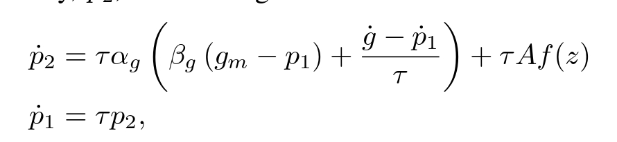

## Dynamic movement primitives for fast online racing trajectories
### TLDR;
- Dynamic movement primitives (DMPs) are useful motion primitives that are composed of a target-driven system and an arbritrary nonlinear system modeled by weighted Guassian kernels.
- I propose an _Acceleration goal_ DMP that extends the a DMP's target system
to handle accelerating targets.
- Our _Acc. goal_ DMP generates trajectories with less
aggressive acceleration and jerk when transitioning
between DMPs in sequence than second order DMPs.
- We generate online DMP trajectories for control in
GranTurismo Sport.
- Our method recovers from starting states where a base-
line controller fails and yields less tracking error, less
aggressive control, and the lowest lap-time compared
to existing methods.

### Background
_Motivation:_ Online trajectory planning improves a control system's adaptability and performance in complex and dynamic environments. This approach enables control systems to handle planning errors, changes in system dynamics, or external disturbances during operation. Motion primitives are a computationally efficient solution to trajectory generation challenges by using pre-defined basic motion patterns.

Dynamic Movement Primitives (DMPs) model movements as non-linear differential equation:

 DMPs match the nonlinear behavior of the parameterized system while driving the trajectory towards a target state. Target crossing is a DMP sequencing technique that switches from one DMP to the next after the original time duration of the first primitive has elapsed. It has only been performed with second-order DMPs that cannot model acceleration accurately. Trajectories that incorporate acceleration are crucial for achieving high performance in many domains, including autonomous racing, where accurate acceleration and braking are critical for faster lap times and stable control.
 $a = x$

<figure>
       
</figure>

<figure>
       
</figure>

<figure>
       
</figure>

### Proposed _acceleration goal_ DMP
