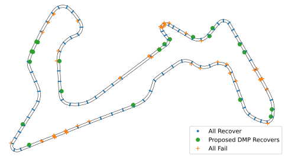
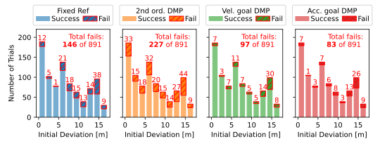
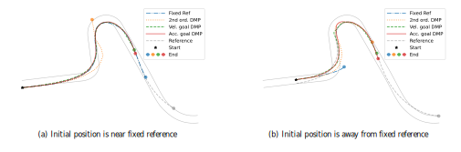
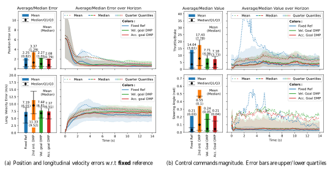

## Dynamic movement primitives for fast online racing trajectories
### TLDR;
- Dynamic movement primitives (DMPs) are useful motion primitives that are composed of a target-driven system and an arbritrary nonlinear system modeled by weighted Guassian kernels.
- I propose an _Acceleration goal_ DMP that extends the a DMP's target system
to handle accelerating targets.
- Our _Acc. goal_ DMP generates trajectories with less
aggressive acceleration and jerk when transitioning
between DMPs in sequence than second order DMPs.
- We generate online DMP trajectories for control in
GranTurismo Sport.
- Our method recovers from starting states where a base-
line controller fails and yields less tracking error, less
aggressive control, and the lowest lap-time compared
to existing methods.

### Trajectory Generation from a Sequence of DMPs
#### Background
_Motivation:_ Online trajectory planning improves a system's adaptability and performance in complex and dynamic environments. Motion primitives are a computationally efficient solution to trajectory generation challenges by using pre-defined basic motion patterns.

Dynamic Movement Primitives (DMPs) model movements as non-linear differential equations. The original second order DMP was proposed by [Kober et al.](https://ieeexplore.ieee.org/document/5509672/):

<figure>
       
</figure>

The DMP is composed of two systems: the goal-attracted system is driven toward the target state and the transformation function  describes the arbitrary dynamics of the trajectory. The arbitrary motion of the transormation function is determined by a weighted sum of Gaussian kernels:

<figure>
       
</figure>

For more information on DMPs, see the review by [Saveriano et al.](https://arxiv.org/pdf/2102.03861.pdf).

#### Proposed _acceleration goal_ DMP
Racing trajectories require accurate dynamics for optimal performance. Therefore I raise the order of the DMP:

<figure>
       
</figure>

Here I propose two changes to the original DMP: 
1. Raise the order of the DMP dynamic equation to the third order
2. Adapt the moving target system to include acceleration to allow non-zero acceleration at target states.

#### Trajectory generation algorithm
Armed with the _acceleration goal_ DMP, I can now accurately model a racing trajectory as a sequence of motion primitives (DMPs):

<figure>

</figure>

Each DMP section is described by a set of weights, $\Theta_j$, and the final or goal state, $G_j$. This allows me to generate new trajectories, $P_G$, of duration $T_G$ using Algorithm 1.

 Specifically, we find the index, $m$, of the closest demonstration waypoint to the observed position; this waypoint corresponds to the $j$-th segment and a reference time in the segment $t_m\in[0,T_S)$. The DMP equations give the derivative of generated trajectory at the desired time steps, starting from reference time $t_m$ (Line 8). If the generated trajectory is integrated to the end (in time) of the current segment (Line 10), it will switch to the DMP information of the following segment ($G_{j+1}, \Theta_{j+1}$), and the reference time is reset to start at the beginning of the subsequent segment (Line 13}).

We employ a model predictive controller (similar to [my other project](https://cwj22.github.io/projects/mpc.html)) to generate the steering and throttle command to track the generated reference trajectories. 

### Experiment 1: Recovery from deviations in Gran Turismo Sport

<figure>

</figure>

#### Results

<figure>

</figure>

#### Comparison of DMP methods at different track locations

<figure>

</figure>

#### Experiment 1: Comparison of tracking error and control commands
The first experiment tests how well the vehicle can recover from states _away_ from a fixed reference trajectory by using the online DMP trajectories.

The experiment goes as follows:
- The car is place at the left, right, and center of evenly spaced points long the track
- The car generates trajectories with the DMPs, and tracks them with the MPC
- The car _recovers_ if within 14 seconds it returns to the fixed reference and stays within a distance of 1.5m for 4 seconds
- Otherwise, the car fails to recover because it did not return to the reference

### Experiment 2: Lap time comparison in Gran Turismo Sport

Specifically, we find the index, $m$, of the closest demonstration waypoint to the observed position; this waypoint corresponds to the $j$-th segment and a reference time in the segment $t_m\in[0,T_S)$. The DMP equations give the derivative of generated trajectory at the desired time steps, starting from reference time $t_m$ (Line 8). If the generated trajectory is integrated to the end (in time) of the current segment (Line 10), it will switch to the DMP information of the following segment ($G_{j+1}, \Theta_{j+1}$), and the reference time is reset to start at the beginning of the subsequent segment (Line 13}).

We employ a model predictive controller (similar to [my other project](https://cwj22.github.io/projects/mpc.html)) to generate the steering and throttle command to track the generated reference trajectories. 

