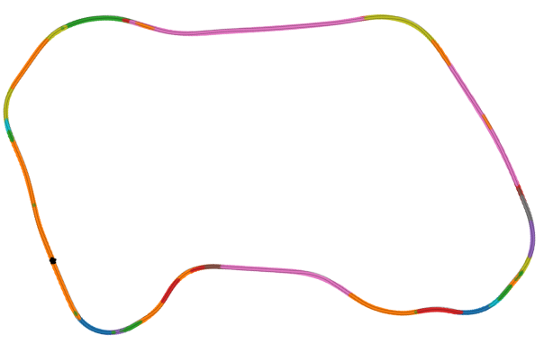

- The proposed Acc. goal DMP extends the target system
to handle accelerating targets.
- Our Acc. goal DMP generates trajectories with less
aggressive acceleration and jerk when transitioning
between DMPs in sequence than second order DMPs.
- We generate online DMP trajectories for control in
GranTurismo Sport.
- Our method recovers from starting states where a base-
line controller fails and yields less tracking error, less
aggressive control, and the lowest lap-time compared
to existing methods.

When a controller tracks a fixed (unchanging) reference trajectory, the controller can be unreliable if the state
deviates significantly from the reference trajectory. Trajectory
generation from the observed state can mitigate this instability,
but doing so online can be computationally prohibitive for complex systems. Dynamic Movement Primitives (DMPs) are goal-driven motion
primitives that generate trajectories driven from the
current state to a demonstrated trajectory while imitating the
dynamics of the demonstration. Sequences of DMPs
joined together can describe long trajectories; however,
existing methods to sequence DMPs with acceleration dynamics
require many demonstrations or suffer from increased compu-
tation as the number of sequences increases. We implement a
sequence of DMPs imitation learning method that generates
trajectories from consecutive DMPs using the time duration of
each motion primitive. My novel \textit{Acc. goal} DMP 
models non-zero acceleration at junctions of DMP sequences,
lowering acceleration and jerk in trajectories generated
from sequences of DMPs compared to existing methods. \uline{My
framework generates online racing trajectories for an MPC for
a racecar in GTS, better
recovering from deviations than standard MPC.}$^4$ Furthermore,
the novel DMP formulation generates trajectories with less
online tracking error, less aggressive control commands, and
faster lap times than other DMP formulations.