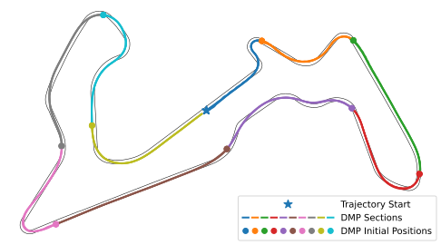

## Data-driven driver analysis and end-to-end learning

In my current work, I am exploring generative adversarial imitation learning (GAIL) for autonomous racing, which leverages generative adversarial networks and reinforcement learning to learn a neural network policy that imitates expert demonstrations by sending an action based on the current observed state. A  binary classifier, known as the discriminator, is trained to distinguish between expert trajectories and trajectories sampled by the current policy. In particular, I am applying the Option-GAIL framework$^6$ to the autonomous racing problem by applying hierarchical reinforcement learning to find a high-level option-picking policy and a low-level action-picking policy. Rather than inferring the expert's options using the current policy, I employ HDP-HMM to identify the expert's options from the expert's trajectory. \uline{By leveraging HDP-HMM, the expert's options can be learned prior to training the high and low-level policies, stabilizing training and outperforming policy-inferred options.}

<object data="/figures/annotatedplot.pdf" width="1000" height="1000" type='application/pdf'></object>

