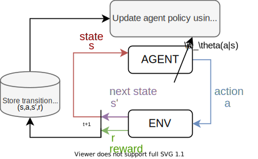
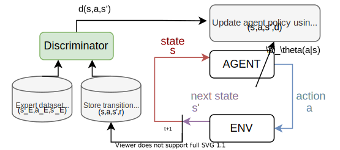

## Adversarial Imitation Learning
### TLDR;
- End-to-end deep reinforcement learning (RL) can improve an agent's policy through environment interaction.
- Adversarial imitation learning (AIL) builds on RL to learn without access to a reward function by exploiting GANs.
- _Contribution:_ I improve AIL's performance in GTS by exploring residual policy learning, exploration with model-based control, options framework for semi-MDPS, and sparse reward guidance.

Typical RL algorithms (e.g. SAC, PPO) use the following framework:

The agent observes a state from the environment, uses it's policy to determine the next action, executes that action in the environment, and observes the next state to repeat the process. The environment gives a reward signal that tells how well the agent is doing, such as the forward course progress made since the last state in racing. The agent's policy is occasionally updated to maximize the expected sum of rewards.

Conversely, Adversarial Imitation Learning (AIL) assumes there is no such reward signal, but we have access to demonstrations of an expert interacting in the environment:

Rather than a reward signal, AIL trains a classifier, known as the discriminator, that gives the probability that a given set of states and actions came from the agent or from the expert. The agent's goal is to fool the discrimintor, i.e. maximize the probability that the discrimintor classifies agent's state-actions as coming from the expert. This solves the following optimization problem:

<object data="/figures/annotatedplot.pdf" width="1000" height="1000" type='application/pdf'></object>

