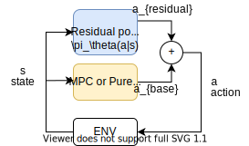

## Generative Adversarial Imitation Learning
### TLDR;
- End-to-end deep reinforcement learning (RL) can improve an agent's policy through environment interaction.
- Generative adversarial imitation learning (GAIL) builds on RL to learn without access to a reward function by exploiting generative adversarial networks (GANs).
- **_Contribution:_** I improve AIL's performance in GTS by exploring 
    - residual policy learning, 
    - exploration with model-based control, 
    - options framework for semi-MDPS, and 
    - sparse reward guidance.

### Background
Typical RL algorithms (e.g. SAC, PPO) use the following framework:

<figure>

    <figcaption>Fig. 1: Typical RL paradigm</figcaption>           
</figure>

The agent observes a state from the environment, uses it's policy to determine the next action, executes that action in the environment, and observes the next state to repeat the process. The environment gives a reward signal that tells how well the agent is doing, such as the forward course progress made since the last state in racing. The agent's policy is occasionally updated to maximize the expected sum of rewards.

Conversely, generative adversarial Imitation Learning (GAIL) assumes there is no such reward signal, but we have access to demonstrations of an expert interacting in the environment:

<figure>

    <figcaption>Fig. 2: Generative Adversarial Imitation Learning</figcaption>           
</figure>

Rather than a reward signal, GAIL uses generative adversarial networks (GANs) to train a classifier, known as the discriminator, that gives the probability that a given set of states and actions came from the agent or from the expert. The agent's goal is to fool the discrimintor, i.e. maximize the probability that the discrimintor classifies agent's state-actions as coming from the expert. 

### GAIL for autonomous racing in Gran Turismo Sport

### Residual Policy Learning
[Residual policy learning](https://arxiv.org/abs/1812.06298) learns a residual NN policy via RL to improve the actions of a base control policy:

<figure>

    <figcaption>Fig. 3: Residual policy learning</figcaption>           
</figure>

In vehicle racing, pure-pursuit control is a simple, geometric control algorithm to track a reference path that determines a steering angle based on a lookahead distance on the path. Pure-pursuit control can track paths at low speeds, but is unstable at high speeds and the limits of handling of the vehicle. Residual policy learning can add a NN policy to the output of a pure-pursuit control to improve control performance, while the pure-pursuit control helps guide exploration, speed up training, and outperform NN policies alone. 

We apply GAIL to learn a NN policy on top of a pure-pursuit base controller. The pure-pursuit control speeds up GAIL training, and 

### Options-GAIL for semi-MDPs

### Bootstrapping with GAIL for sparse rewards

