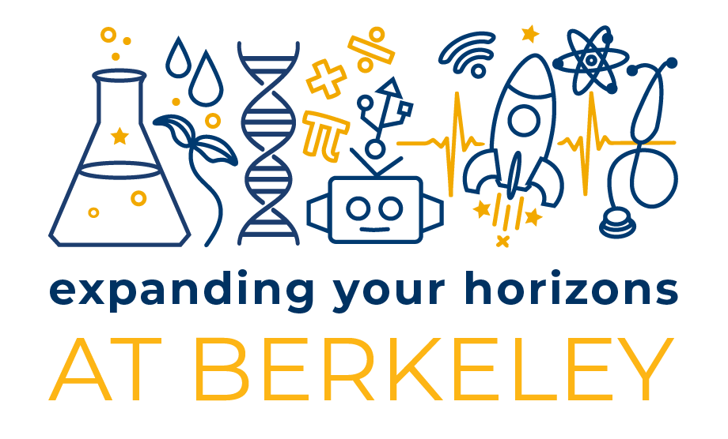

## Service & Teaching

    

        
        

            
 Event Co-Chair | May 2021 - May 2023 (2 years)  

            
 Logistic Committee Chair | May 2020 (1 year)  

            
 Logistics Committee Member | May 2019 (1 year)  

        

    

    

    <a href="https://www.ocf.berkeley.edu/~eyh/index.html">EYH@Berkeley</a>
    

<i>
Expanding your Horizons @ Berkeley is an annual STEM conference to expose middle school womxn to career possibilities in STEM. The conference is a single-day event where students have the opportunity to learn from 30+ workshops led by volunteers in industry and academia. Each student's conference program includes a keynote address, 3 classroom-based workshops, and free lunch! Organization of the conference is <b>entirely student led </b>by the EYH planning committee.</i>

- <b><i>2 years in charge of organizing</i></b> annual STEM conference for 300+ students
- Managed 40 planning committee volunteers and 150 day-of-volunteers
- Organized volunteers into 7 different committees and delegated tasks appropriately to manage Food, Finance, Programs, Transportation, etc

 

    

        
        

            
 Graduate Instructor | Aug. - Dec. 2023 (4  Months)  

        

    

    

    <a href="https://classes.berkeley.edu/content/2023-spring-engin-178-001-lec-001">Course Description</a>
    

- Course: Statistics and Data Science for Engineers
- Led 4 hour-long Python-based lab sections each week on statistics and machine learning topics to upper-level undergraduates

 

    

        
        

            
 Instructor |  Aug. - Sep. 2023(3 weeks)  

        

    

    

    <a href="https://classes.berkeley.edu/content/2023-spring-engin-178-001-lec-001">Course Description</a>
    

<i> Summer Institute for the Gifted (SIG) at University of California, Berkeley, provides academically advanced students with an exciting and challenging educational experience at one of the nation's top public universities. </i>

- Instructed two intensive, hands on courses for gifted students (each class was 3hrs/day for 3 weeks)
- Courses:  Creative Engineering and Robotics / AI Robotics